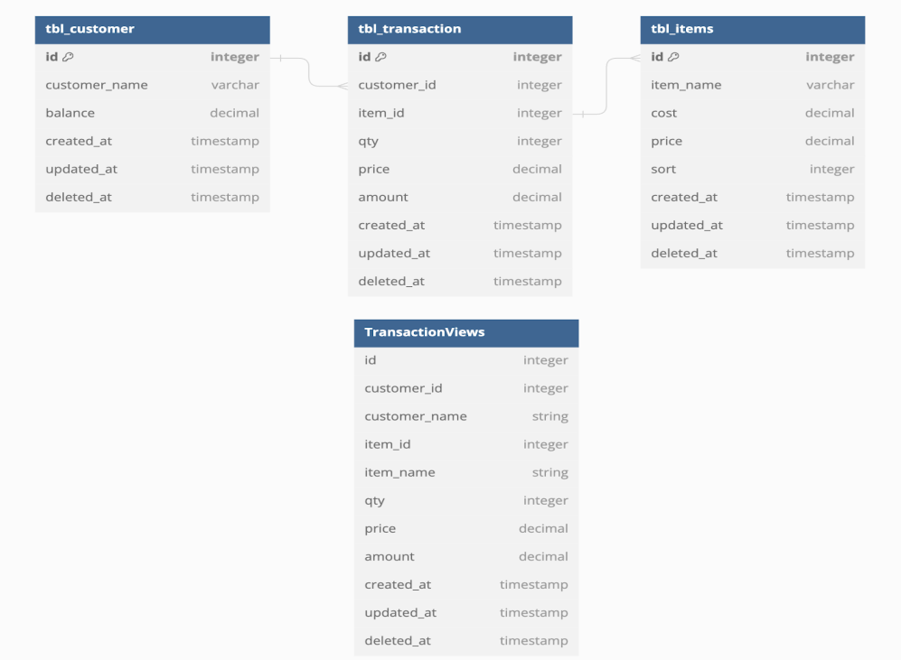
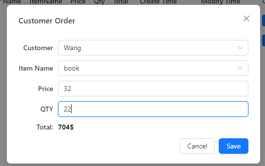
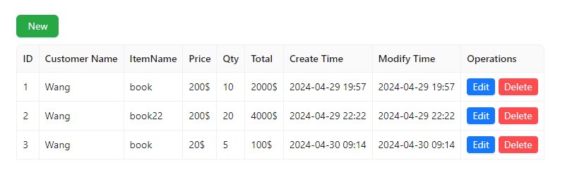

# TBL Service

## TBL backend

#### Candidate build Rest API to create, Insert, Update, Delete on tbl_customer, tbl_transaction, tbl_items

#### Write a query to create a TransactionViews by using inner join and then write one Api to get data from TransactionViews

#### Write Api to filter data from TransactionViews ( Search by id, customer_name, and item_name)

## TBL frontend

#### Create UI to display data as Table

#### Add Button to create new item

#### Add Button to update item in table

#### Add Button to delete item from table

